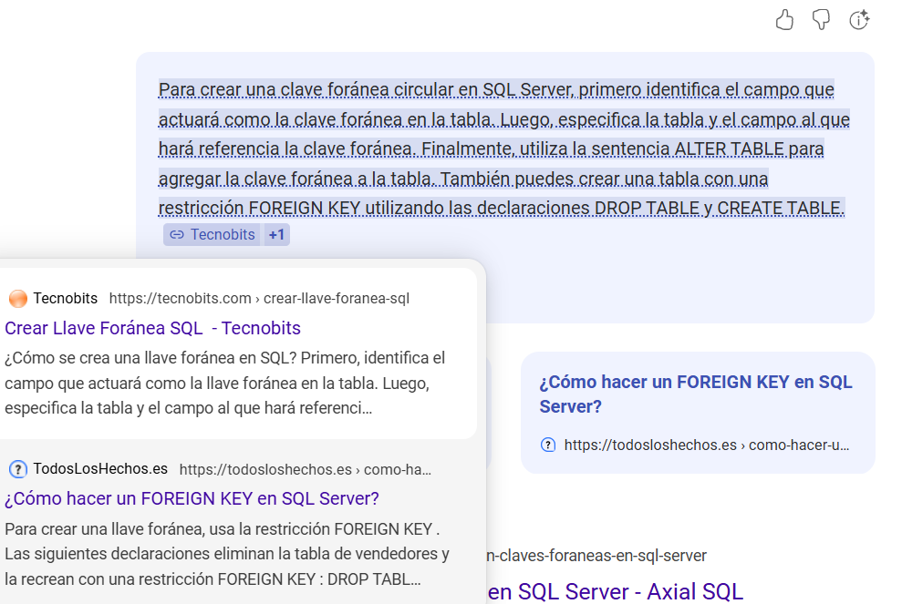

No sabía cómo hacer algunas cosas y no me salían, entonces lo investigué:

- [Cómo crear una llave foránea en SQL](https://tecnobits.com/crear-llave-foranea-sql/)
- [Cómo hacer un Foreign Key en SQL Server](https://todosloshechos.es/como-hacer-un-foreign-key-en-sql-server)
- [Crear tabla con llave foránea SQL Server](https://jmjinformatico.es/crear-tabla-con-llave-foranea-sql-server/)

